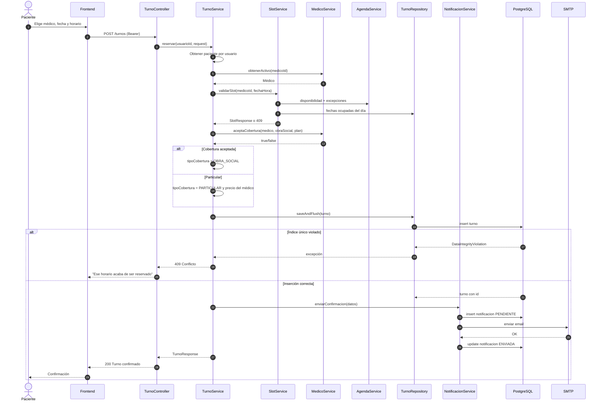
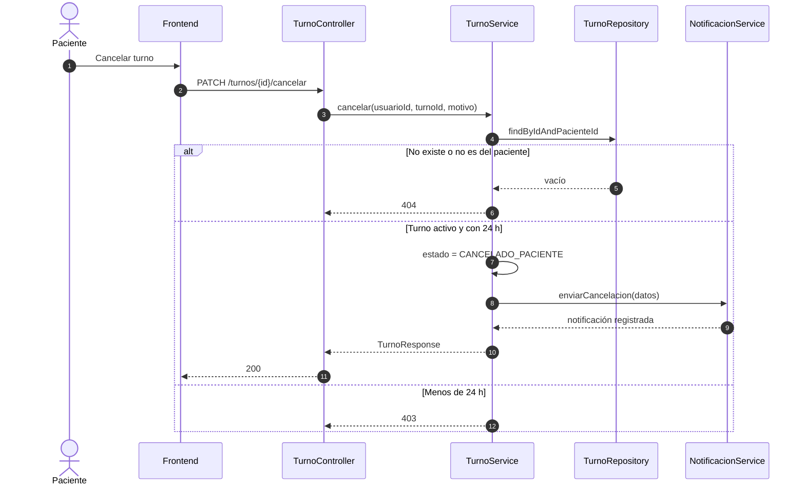
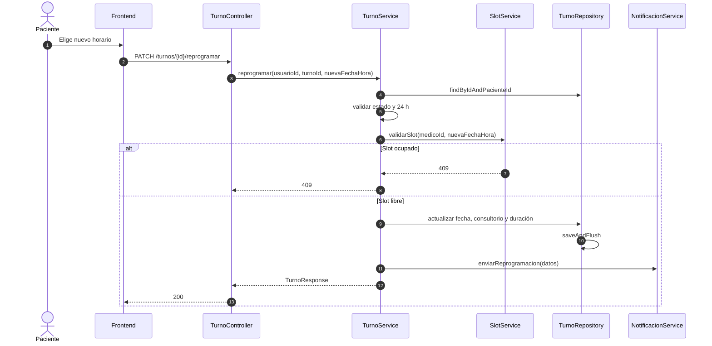

# Secuencia de reserva

```mermaid
sequenceDiagram
    autonumber
    actor P as Paciente
    participant F as Frontend
    participant C as TurnoController
    participant TS as TurnoService
    participant SS as SlotService
    participant MS as MedicoService
    participant AG as AgendaService
    participant TR as TurnoRepository
    participant NS as NotificacionService
    participant DB as PostgreSQL
    participant SMTP as SMTP

    P->>F: Elige médico, fecha y horario
    F->>C: POST /turnos (Bearer)
    C->>TS: reservar(usuarioId, request)
    TS->>TS: Obtener paciente por usuario
    TS->>MS: obtenerActivo(medicoId)
    MS-->>TS: Médico
    TS->>SS: validarSlot(medicoId, fechaHora)
    SS->>AG: disponibilidad + excepciones
    SS->>TR: fechas ocupadas del día
    SS-->>TS: SlotResponse o 409
    TS->>MS: aceptaCobertura(medico, obraSocial, plan)
    MS-->>TS: true/false
    alt Cobertura aceptada
        TS->>TS: tipoCobertura = OBRA_SOCIAL
    else Particular
        TS->>TS: tipoCobertura = PARTICULAR y precio del médico
    end
    TS->>TR: saveAndFlush(turno)
    TR->>DB: insert turno
    alt Índice único violado
        DB-->>TR: DataIntegrityViolation
        TR-->>TS: excepción
        TS-->>C: 409 Conflicto
        C-->>F: "Ese horario acaba de ser reservado"
    else Inserción correcta
        DB-->>TR: turno con id
        TS->>NS: enviarConfirmacion(datos)
        NS->>DB: insert notificacion PENDIENTE
        NS->>SMTP: enviar email
        SMTP-->>NS: OK
        NS->>DB: update notificacion ENVIADA
        TS-->>C: TurnoResponse
        C-->>F: 200 Turno confirmado
        F-->>P: Confirmación
    end
```

## Cancelación

```mermaid
sequenceDiagram
    autonumber
    actor P as Paciente
    participant F as Frontend
    participant C as TurnoController
    participant TS as TurnoService
    participant TR as TurnoRepository
    participant NS as NotificacionService

    P->>F: Cancelar turno
    F->>C: PATCH /turnos/{id}/cancelar
    C->>TS: cancelar(usuarioId, turnoId, motivo)
    TS->>TR: findByIdAndPacienteId
    alt No existe o no es del paciente
        TR-->>TS: vacío
        TS-->>C: 404
    else Turno activo y con 24 h
        TS->>TS: estado = CANCELADO_PACIENTE
        TS->>NS: enviarCancelacion(datos)
        NS-->>TS: notificación registrada
        TS-->>C: TurnoResponse
        C-->>F: 200
    else Menos de 24 h
        TS-->>C: 403
    end
```

## Reprogramación

```mermaid
sequenceDiagram
    autonumber
    actor P as Paciente
    participant F as Frontend
    participant C as TurnoController
    participant TS as TurnoService
    participant SS as SlotService
    participant TR as TurnoRepository
    participant NS as NotificacionService

    P->>F: Elige nuevo horario
    F->>C: PATCH /turnos/{id}/reprogramar
    C->>TS: reprogramar(usuarioId, turnoId, nuevaFechaHora)
    TS->>TR: findByIdAndPacienteId
    TS->>TS: validar estado y 24 h
    TS->>SS: validarSlot(medicoId, nuevaFechaHora)
    alt Slot ocupado
        SS-->>TS: 409
        TS-->>C: 409
    else Slot libre
        TS->>TR: actualizar fecha, consultorio y duración
        TR->>TR: saveAndFlush
        TS->>NS: enviarReprogramacion(datos)
        TS-->>C: TurnoResponse
        C-->>F: 200
    end
```
